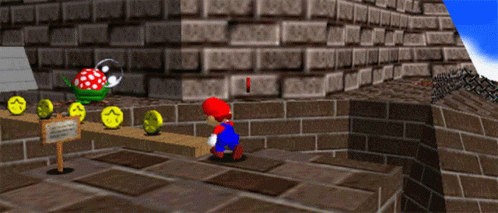

<div align="center">
    
</div>

<h1 align="center">Hi 👋, I'm Mocao</h1>
<h3 align="center">I'm a Growtopia Private Server Developer (Joined since 2019)</h3>

<p align="left">  </p>

- 🔭 I’m currently working on
**Growtopia Private Server**

- 🌱 I’m currently learning **C#**

- 🤝 I’m looking for help with [IKT](https://iktindonesia.ml/)

- ⚡ Fun fact
**I'm a good person**

```c#
class Program
    {
        static void Main(string[] args)
        {
            Console.WriteLine("ENJOY GUYS!");
            Console.ReadKey();
        }
    }
```

<h3 align="left">Connect with me:</h3>
<p align="left">
<a href="https://www.youtube.com/c/christoperxx" target="blank"></a>
<a href="https://discord.gg/https://discord.gg/upJ9Mhdn" target="blank"></a>
</p>

<h3 align="left">Languages and Tools:</h3>
<p align="left"> <a href="https://developer.android.com" target="_blank" rel="noreferrer">  </a> <a href="https://aws.amazon.com" target="_blank" rel="noreferrer">  </a> <a href="https://azure.microsoft.com/en-in/" target="_blank" rel="noreferrer">  </a> <a href="https://www.gnu.org/software/bash/" target="_blank" rel="noreferrer">  </a> <a href="https://www.cprogramming.com/" target="_blank" rel="noreferrer">  </a> <a href="https://www.w3schools.com/cpp/" target="_blank" rel="noreferrer">  </a> <a href="https://www.w3schools.com/cs/" target="_blank" rel="noreferrer">  </a> <a href="https://www.w3schools.com/css/" target="_blank" rel="noreferrer">  </a> <a href="https://cloud.google.com" target="_blank" rel="noreferrer">  </a> <a href="https://www.w3.org/html/" target="_blank" rel="noreferrer">  </a> <a href="https://developer.mozilla.org/en-US/docs/Web/JavaScript" target="_blank" rel="noreferrer">  </a> <a href="https://www.mongodb.com/" target="_blank" rel="noreferrer">  </a> <a href="https://www.microsoft.com/en-us/sql-server" target="_blank" rel="noreferrer">  </a> <a href="https://www.mysql.com/" target="_blank" rel="noreferrer">  </a> <a href="https://www.perl.org/" target="_blank" rel="noreferrer">  </a> <a href="https://reactnative.dev/" target="_blank" rel="noreferrer">  </a> </p>

<p>&nbsp;</p>
